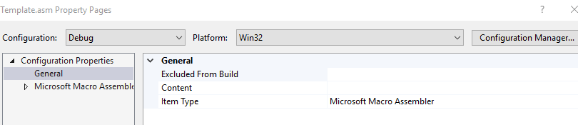

# Project Setup

- Create Empty VisualC++ project
- Go to project properties
    - Linker
        - System
            - set SubSystem to console
            - 

- add Build Dependencies
- 
  - Select masm
  - 
- Go to .asm properties
    - Set Item Type to:
        - Microsoft Macro Assembler
    - 
- If Error about safe Exception Handlers:
    - Go TO:
        - Linker
            - Advanced
                - Image Has Safe Exception Handlers > No
    - 

